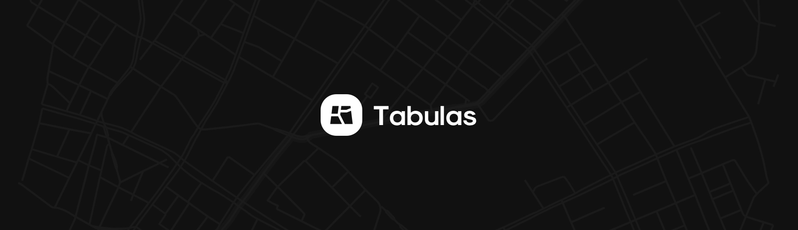

<div align="center">
<b>Tabulas</b> . Mission planning modules and the applications of path-finding algorithms in Self-Driving Cars (Analysis, Implementation)


</div>

<br>


---

<br>

## 💎 **Repository structure**
The architecutre of consists of five **directories** [analysis, data, src, static, templates]


| Service | Type | Description |
----------|-----|------------|
[**analysis**]()  | Placeholder |   functionalities
[**data**]()   | Placeholder | functionalities
[**src**]()    | Placeholder | functionalities
[**static**]() | Placeholder |  placeholder
[**templates**]()   | Placeholder | functionalities


<br>
<br>

## 📦 **Setup**

   ---   


<br>

1. ### **Setting up environment**
   
   The following instructions work for <small>[Mac, Linux, Windows]</small>

   ---
   <br>

   1 - Install virutal env to be able to create Python environments

   ```lua
   sudo pip3 install virtualenv 
   ```

   2 - Create a new environment

   ```lua
   virtualenv env
   ```
   
   3 - Active the virtual environment:

   ```lua
   virtualenv env
   ```


   ---

<br>


<br>

2. ###  **Modules Setup**
   After setting up your development environment make sure to install the app's required packages by running:
   ```
   pip3 install -r requirements.txt
   ```

   ---
<br>

3. ###  **Setting up environment variables**

   ---
   <br>

   1 - Naming the flask App:
   ```
   export FLASK_APP=tabulas
   ```
   <br>

   2 - Setting up development mode:
   ```
   export FLASK_ENV=development
   ```
   <br>

<br>

---

<br>


## 🚀 **Run**

   And now you can finally run the app using: 
   ```
   flask run
   ```

---

<div align="center">

**Thanks for reading 🎉**

</div>