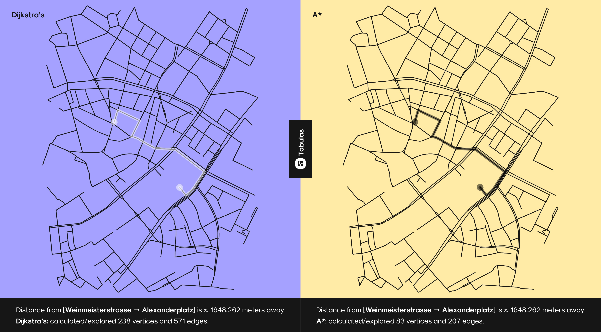

# **Tabulas . Core implementation**
The implementation of the core compinenets and algorithms of searching for Paths and finding the nearest path between two points

 

## **Implementation utilities**
---

- [OSMNX library](https://osmnx.readthedocs.io/en/stable/) i used to generate Python graphs from Open Street Map (OSM) data
- Which will be representing a road network with a succession of vertices representing intersections, the beginning or finish of a road, or a change in a road's terrain/topography.

- These graphs will be represented using [NetworkX library](https://networkx.github.io/documentation/stable/) which stores all of these pieces of information we've mentioned, and all the map's graphics are downloaded through OSMNX from [OpenStreetMap](https://www.openstreetmap.org)
- Each vertex has a unique id, a set of coordinates, the type of road to which it belongs, the maximum speed, the road name, a list of adjacent vertices with all of their features and properties, and the distance in meters from the current vertex.
- Flask framework to serve a web application where users can interact with the algorithms and generate configurable pictures of the distnaces from a UI

 

## **Finding the path/shortest path problem**
---

In graphs, finding the shortest path problem is about finding a path between two points in a graph, so that that the sum of the weights of its constituent edges is minimized [wikipedia](https://en.wikipedia.org/wiki/Shortest_path_problem), so finding the shortest path entails calculating the cost of travel based on the distance between the vertices. Because vertices store the distance between themselves and their neighbors; Therefore retrieving the cost is extremely simple and requires no extra operations.

- In order to find a path between two vertices in a network context, we will assume that we would begin by knowing the ids of the two vertices; alternatively, if we just had the names of two places, we would need to convert the names to coordinates and then look for the nearest vertices to these in our graph.

- With a built-in algorithm, `OSMnx` makes it simple to find the shortest path between two places, and we can completly use it for our use-case, but instead, i'll use the Dijkstra's and A* algorithms that i've previously analyzed, and tweak them a bit to let them interact with the network that is offered by OSMnx, and finally return the number of vertices and edges traversed by each. Furthermore, I will analyze and compare both strategies for finding the shortest path between two vertices.

 

---

<small>Wikipedia contributors. (2021, July 12). Shortest path problem. In Wikipedia, The Free Encyclopedia. Retrieved 08:21, October 27, 2021, from https://en.wikipedia.org/w/index.php?title=Shortest_path_problem&oldid=1033189970</small>

 

## **Implementation common instructions**
---
All of the algorithms will have some code in common; in fact, the only code that will differ is the "Graph" class. The shared code includes the following:

type | Description | Dijkstra | A* | Time complexity|
----|------|-----|-----|---|
`PriorityQueue` | `PriorityQueue` data structure that we have already used while implementing the Dijkstra's and A* algorithms | ✅ | ✅ |
OSMnx configuration | The configuration for the OSMnx library
`geocode` Call | Two calls to the `geocode` method to get the coordinates of two points | ✅ | ✅ |
Determining boundaries of the graph based the 2 points's coordinates | Instructions that determines the boundaries of the graph that we are requiring based on the 2 points's coordinates | ✅ | ✅ |
`graph_from_bbox` call | Calling `graph_from_bbox` method to request the graph (or get if from the caches if already downloaded) | ✅ | ✅ |
`get_nearest_node` Calls | 2 calls to the `get_nearest_node` method to get the nearest nodes to the two points | ✅ | ✅ |
`Graph` class | Initializing the `Graph` class | ✅ | ✅ |
Call to finding the shortest path | Calling  `Dijkstra's` or `A*` to calculate the shortest path <small>Those two algorithms are methods of the class `Graph` class</small> | ✅ | ✅ |
Algorithms results print | Showing distance between `Point A` and `Point B` and how many vertices and edges have been calculated by the two called algorithms | ✅ | ✅ |
`plot_graph_route` Method | Calling `plot_graph_route` method to plot the graph downloaded by the library with the route computed by `Dijkstra's` or `A*` | ✅ | ✅ |

 
 

## **🧮 Algorithms Results**
---
 

### **Dijkstra's Results**
---
Based on my previous analysis of Dijkstra's, it's clear that the algorithm I'm using to handle requests in the app is very similar to the one we analyzed before; one of the main differences is the way neighbors and the cost to get to a vertex are retrieved, and that's due to the nature of the graph we're working with; the reason for this assumption is that the only two operations that changed require the same time complexity as the the operations in the example of Dijkstra's algorithm that we analyzed before; therefore this algorithm's complexity is 

$O(|V| + |E|⋅log(|V|))$

 
 
### **A\*'s Results**
---

The implementation of A* in the app is similar to the implementation I previously analyzed, but the difference in this case is not only in the different way to get the neighbors and their cost, but it's also in the heuristic function, which calculates the distance but this time in coordinates units rather than meters, which is why I used the [Haversine Formula](https://rosettacode.org/wiki/Haversine_formula), The only two operations that have changed are the same as in Dijkstra's algorithm, but as we have seen, the time complexity of this algorithm is determined by its heuristic function; Therefore, The worst-case time complexity of this algorithm remains $O(b^{d})$, as we saw while analyzing it

 

## **Comparing differences using Tabulas**

> If you want to interact with Tabulas, you can find the setup instructions [here](../README.md)

This picture shows us that both algorithms implementation found the same route,
Altought the difference us the number of the reduced vertices and edges that were explored is different:

and for the sake of this example we're counting the distance between two close areas in on map, but what applies on the ditance between `[Weinmeisterstrasse` → `Alexanderplatz]` applies on any other two points as long as it doesn't violate any of the structure restrictions.

---

So based on the algorithms output:

- **Dijkstra's**: Distance from [Weinmeisterstrasse → Alexanderplatz] is 1648.262 meters away 🎉 | Dijkstra's 🗾 calculated/explored 238 vertices and 571 edges.
- **A\*** Distance from [Weinmeisterstrasse → Alexanderplatz] is 1648.262 meters away 🎉 A* 🗾 calculated/explored 83 vertices and 207 edges.

Algorithms | Vertices | Edges | Length (m) 
----|---|--|--|
Dijkstra’s | 238 | 571 | 1648.262
A* | 83 | 207 | 1648.262

and after using The Percentage Decrease Formula:

$Percentage \ \  Decrease$ = 
$\frac{Starting Value − Final Value}{|Starting Value|} * 100$	

 

---

And finally can verify that `A*` is extremly more efficent thatn `Dijkstra's` 🎉

